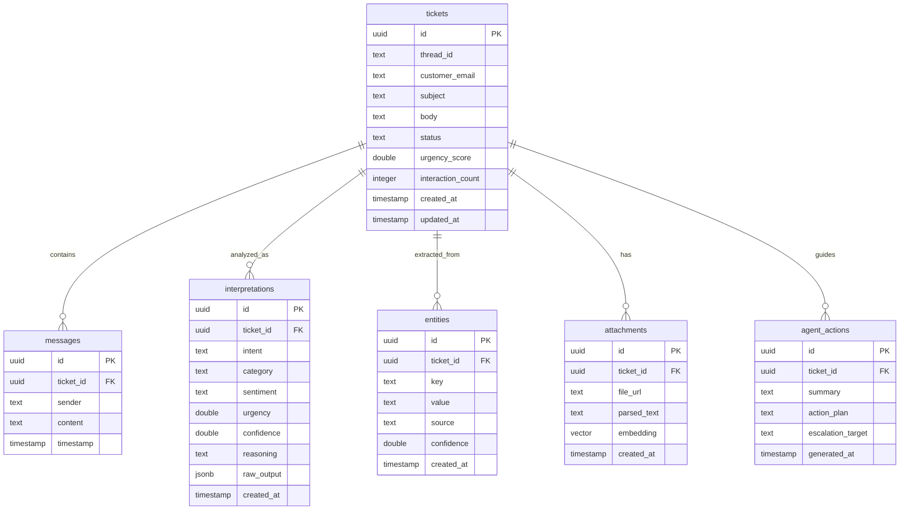

# Intelligent Customer Support Email Triage & Action System

## 1. Introduction

The **Intelligent Customer Support Email Triage & Action System** is a unified, decision-driven support layer designed to transform reactive email handling into a proactive, coordinated workflow. Unlike traditional ticketing systems that focus solely on classification and suggestions, this platform addresses the root cause of support latency: **information gaps in initial customer emails**. By performing multi-dimensional interpretation of incoming messages, the system proactively requests missing details (like invoice numbers or tracking IDs) through context-aware responses, generates structured action plans for agents using RAG-enriched data from attachments, and dynamically manages urgency to ensure no request is neglected. The ultimate objective is to minimize frictional back-and-forth communication, reduce resolution time, and provide a seamless, transparent experience for both customers and support teams.

## 2. Tech Stack

### Backend
- **Framework**: FastAPI (Python 3.13)
- **LLM Reasoning**: Google Gemini (via `google-generativeai`)
- **Database & Auth**: Supabase (PostgreSQL)
- **Vector Search**: pgvector (for RAG)
- **Document Processing**: PyMuPDF, pdfplumber (PDF parsing), Tesseract OCR (Image text extraction)
- **Environment Management**: `python-dotenv`

### Frontend
- **Framework**: React (Vite)
- **Language**: TypeScript
- **State Management**: Zustand
- **Styling**: Vanilla CSS (Modern, decision-focused UI)
- **API Interaction**: Fetch API

### Infrastructure & DevOps
- **Containerization**: Docker, Docker Compose
- **Cloud Services**: Supabase (Database, Storage, Edge Functions)
- **Version Control**: Git

## 3. Basic Installation Guide

### Prerequisites
- Python 3.13+
- Node.js 18+ & npm
- Tesseract OCR (for image processing)
  - **Mac**: `brew install tesseract`
  - **Ubuntu**: `sudo apt install tesseract-ocr`
- A Supabase Project
- A Google Gemini API Key

### 1. Clone the Repository
```bash
git clone https://github.com/faizaan-nasir/CustomerSupportEmailTriage.git
cd CustomerSupportEmailTriage
```

### 2. Setup Backend
```bash
cd apps/backend
python -m venv venv
source venv/bin/activate  # On Windows: venv\Scripts\activate
pip install -r requirements.txt
cp .env.example .env
# Edit .env with your SUPABASE and GEMINI credentials
```

### 3. Setup Frontend
```bash
cd ../../apps/frontend
npm install
cp .env.example .env
# Edit .env with your VITE_SUPABASE and VITE_API credentials
```

### 4. Database Setup
Ensure your Supabase database has the required schema applied (tables: `tickets`, `interpretations`, `entities`, `messages`, `attachments`, `agent_actions`) and the `pgvector` extension enabled.

### 5. Running the Application
**Option A: Using Docker (Fastest)**
```bash
# From the root directory
docker-compose up --build
```

**Option B: Manual Startup**
- **Backend**: `uvicorn app.main:app --reload --port 8000` (from `apps/backend`)
- **Frontend**: `npm run dev` (from `apps/frontend`)

## 4. Supabase Relationship Schema

The system uses a highly relational PostgreSQL schema on Supabase to maintain a single source of truth across all pipeline stages. All child tables are linked to the primary `tickets` table, ensuring that interpretation, extraction, and history are perfectly synchronized.

### Entity Relationship Diagram



### Key Database Features:
- **pgvector**: Enables semantic similarity search across attachments for RAG extraction.
- **Optimized Indexing**: Employs targeted B-tree indexes across critical query paths to ensure low-latency dashboard updates and high-performance triage as the system scales.

## 5. Conclusion

The **Intelligent Customer Support Email Triage & Action System** represents a shift from reactive helpdesk tools to a coordinated, proactive decision system. By leveraging Large Language Models for deep interpretation and RAG for document intelligence, the system successfully bridges the gap between raw customer input and actionable resolution. This architecture not only speeds up response times but also ensures that support operations are consistent, fair, and data-driven.
